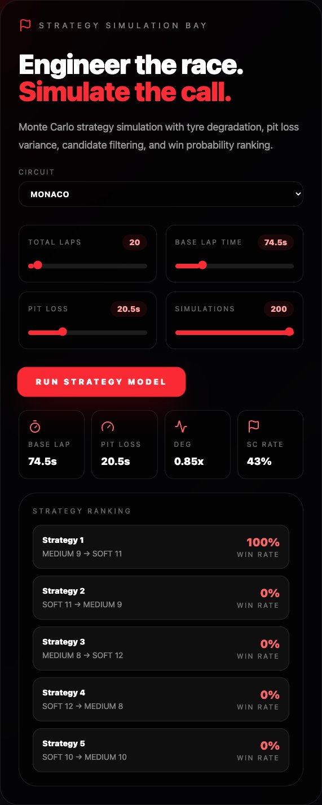
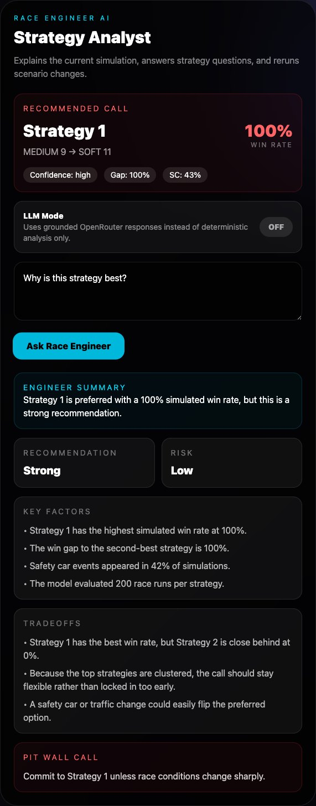
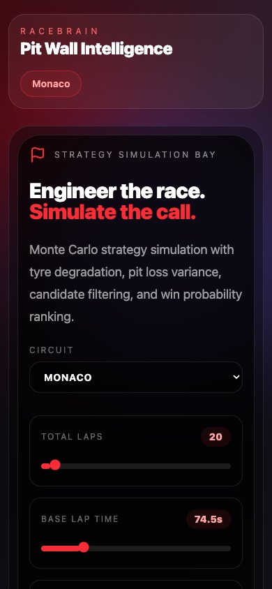

# RaceBrain

RaceBrain is a React and FastAPI portfolio project for comparing simplified Formula 1 tyre strategies. It combines deterministic race-time estimates, Monte Carlo ranking, grounded strategy explanations, and historical race context from OpenF1.

The model is an educational strategy simulator, not a validated physics model or a live pit-wall system. OpenF1 views query available upstream session data; their freshness depends on OpenF1 and this application does not ingest car telemetry continuously.

## Architecture

```text
React + TypeScript + Vite
        |
        | HTTP (VITE_API_URL)
        v
FastAPI
  |-- track profiles and simulation engines
  |-- deterministic and optional OpenRouter explanations
  `-- OpenF1 HTTP client and historical race-state summaries
```

Circuit metadata is owned by the backend and exposed through `GET /tracks`. The frontend loads those profiles and can override base lap time and pit loss per simulation request. Monte Carlo requests may include a seed for reproducible comparisons; ordinary requests remain unseeded.

Production uses a Vercel-hosted Vite frontend calling a Render-hosted FastAPI service over HTTPS. Neither deployment includes a database or persistent application storage.

## Live deployment

- Frontend: https://racebrain-mauve.vercel.app
- Backend: https://racebrain-api.onrender.com
- API documentation: https://racebrain-api.onrender.com/docs

To try the demo, open the frontend, select a circuit, optionally adjust base lap time or pit loss, and run the strategy model. Historical OpenF1 requests depend on upstream availability. The optional LLM mode is unavailable in this deployment because no OpenRouter key is configured.

## Product tour

| Strategy simulation and ranking | Race Engineer analysis |
| --- | --- |
|  |  |

<p align="center">
  
</p>

The historical race intelligence flow is also shown in [`docs/screenshots/historical-race-intelligence.jpg`](docs/screenshots/historical-race-intelligence.jpg). OpenF1 data remains dependent on upstream availability.

## Local setup

Backend (Python 3.11+):

```bash
cd backend
python -m venv .venv
source .venv/bin/activate
python -m pip install -r requirements.txt
cp .env.example .env
uvicorn app.main:app --reload
```

The OpenRouter key is optional. Without it, the API starts normally and returns `503` only for LLM-backed explanation requests.

Frontend (Node 24 recommended):

```bash
cd frontend
npm ci
cp .env.example .env.local
npm run dev
```

Defaults: API `http://127.0.0.1:8000`, frontend `http://localhost:5173`.

## Environment variables

| Location | Variable | Required | Purpose |
| --- | --- | --- | --- |
| Backend | `CORS_ALLOWED_ORIGINS` | Production | Comma-separated explicit frontend origins |
| Backend | `OPENROUTER_API_KEY` | No | Enables OpenRouter-backed explanations |
| Frontend | `VITE_API_URL` | Production | Public URL of the FastAPI service |

Never put a secret in a `VITE_` variable; Vite embeds those values in browser assets.

## Validation

```bash
cd backend
pytest
python -c "from app.main import app; print(app.title)"

cd ../frontend
npm ci
npm run lint
npm run build
npm run test:responsive
```

GitHub Actions runs the same backend and frontend checks on pushes and pull requests.

Responsive release verification covers Chrome viewports at 390 × 844, 430 × 932, 768 × 1024, and 1440 × 900. The focused Playwright regression checks the 390px layout for document overflow, core controls, and primary-card containment.

## Deployment

### Render backend

The backend is deployed from `render.yaml` on Render's free web-service plan. Set `CORS_ALLOWED_ORIGINS` to the exact Vercel origin and optionally set `OPENROUTER_API_KEY`. The configured health check is `/health`.

Production URL: https://racebrain-api.onrender.com

### Vercel frontend

Import the repository, set the project root to `frontend`, and set `VITE_API_URL` to the Render backend URL. `frontend/vercel.json` declares the Vite build and output directory.

Production URL: https://racebrain-mauve.vercel.app

Production environment-variable names are `CORS_ALLOWED_ORIGINS` and optional `OPENROUTER_API_KEY` on Render, plus `VITE_API_URL` on Vercel. Values should be configured in the hosting dashboards and never committed.

## Current capabilities and limitations

- Preserves 24 built-in circuit profiles and rejects unsupported identifiers.
- Compares generated one-stop and two-stop strategies with a simplified tyre-degradation model.
- Uses common sampled lap, pit, and safety-car conditions across strategies within each seeded race comparison.
- Reads historical or upstream-available OpenF1 sessions, drivers, laps, stints, weather, and race-control messages.
- Produces heuristic strategy calls from that race state; it does not operate a live timing feed or guarantee real-time decisions.
- LLM explanations are constrained by supplied simulation data but still depend on an external model provider.
- The free Render service can spin down when idle, so the first API request after inactivity may take noticeably longer.
- There is no authentication, database, persistent telemetry pipeline, historical replay UI, or production monitoring yet.

## Main endpoints

- `GET /health`
- `GET /tracks` and `GET /tracks/{track_id}`
- `POST /monte-carlo/generate`
- `POST /race-engineer/briefing`
- `POST /ai/explain`, `POST /ai/llm-explain`, and `POST /ai/scenario`
- `GET /race-data/sessions` and related OpenF1 endpoints
- `GET /live-strategy/session/{session_key}`

## Disclaimer

RaceBrain is not affiliated with Formula 1, the FIA, or any Formula 1 team.
