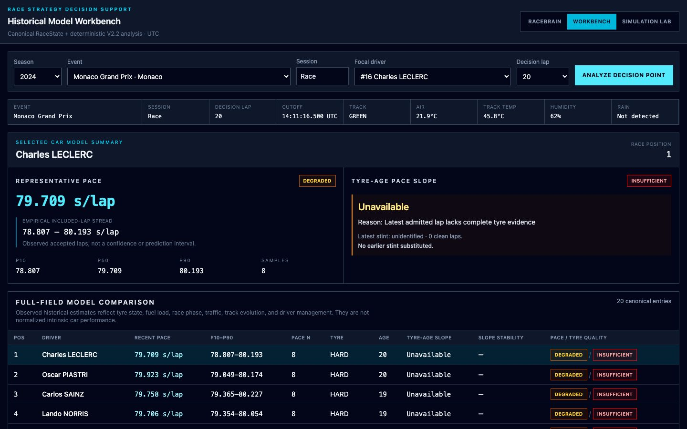
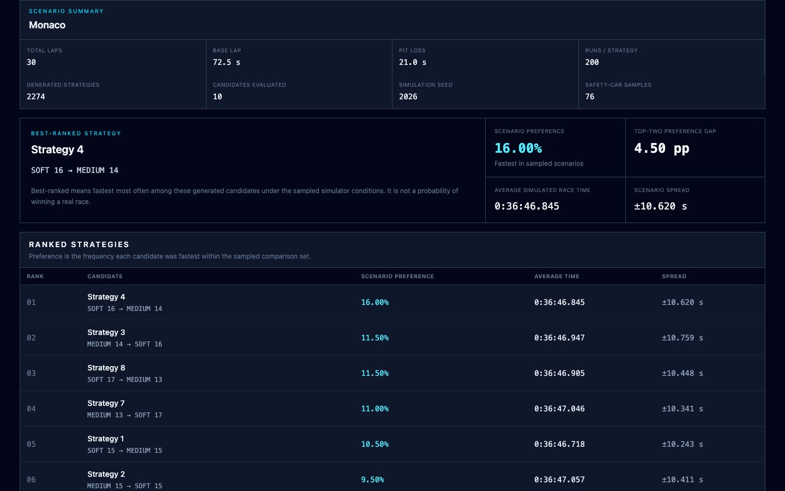

# RaceBrain

**Formula 1 race-strategy decision support built around cutoff-safe historical reconstruction, empirical pace and tyre modelling, robustness analysis, and stochastic scenario exploration.**

RaceBrain reconstructs what was knowable at a historical decision point, models representative clean-lap pace and within-stint tyre-age behaviour, exposes the evidence and limitations behind every estimate, and keeps stochastic strategy exploration separate from the deterministic historical model.

[**Live App**](https://racebrain-mauve.vercel.app) · [**Historical Workbench**](https://racebrain-mauve.vercel.app/workbench) · [**Simulation Lab**](https://racebrain-mauve.vercel.app/simulation) · [**Backend Health**](https://racebrain-api.onrender.com/health) · [**API Docs**](https://racebrain-api.onrender.com/docs)

The primary V2 product is the **Historical Model Workbench**. It rebuilds a canonical full-field race state at a strict observation cutoff and runs auditable pace, tyre-age, and robustness models over that bounded evidence. The separate **Scenario Simulation Lab** explores generated strategies with Monte Carlo perturbations; it is experimental and does not claim to predict a real race winner.

## What RaceBrain does

Race strategy is a state-estimation and decision problem before it is an optimization problem. RaceBrain focuses first on making the state and model evidence defensible.

| Surface | Purpose | Semantics |
| --- | --- | --- |
| [Product entrance](https://racebrain-mauve.vercel.app) | Explains the current system and routes operators to the supported tools | Current capability status, without unbuilt-feature claims |
| [Historical Model Workbench](https://racebrain-mauve.vercel.app/workbench) | Reconstructs a historical decision point and evaluates full-field pace and tyre evidence | Deterministic, cutoff-safe, provider-independent, evidence-first |
| [Scenario Simulation Lab](https://racebrain-mauve.vercel.app/simulation) | Compares generated one-stop and two-stop candidates under sampled race-time conditions | Stochastic, exploratory, reproducible with an optional seed |

## Historical Model Workbench

The workbench reconstructs a canonical `RaceState` for every competitor using only observations available at the selected completed lap. It then builds a bounded modelling context and exposes:

- full-field position, gap, tyre, weather, race-control, and data-quality state;
- representative clean-lap pace from a recent lap-number window;
- empirical p10/p50/p90 spread across the accepted pace evidence;
- within-stint tyre-age pace slope for the latest defensible stint;
- deterministic leave-one-observation-out slope ranges and sign stability;
- every accepted and excluded observation with typed exclusion reasons;
- provenance, model versions, configuration hashes, and typed unavailable states.

[](docs/assets/historical-model-workbench.jpg)

*Production Historical Model Workbench: Monaco 2024, Charles Leclerc, lap 20. Representative pace is available from eight accepted laps; the tyre slope correctly remains unavailable because the latest admitted lap lacks complete tyre evidence.*

An unavailable result is part of the contract, not a UI failure. RaceBrain does not substitute an earlier stint, unrelated driver, stale estimate, or fabricated fallback when the required evidence is absent.

## Scenario Simulation Lab

The simulation lab preserves the useful stochastic branch of the original project while separating it from historical V2 modelling. It:

- generates one-stop and two-stop candidate strategies;
- deterministically pre-ranks the generated candidates;
- compares a bounded candidate set under paired Monte Carlo conditions;
- perturbs lap time, pit loss, degradation, and safety-car scenarios;
- reports scenario preference, average simulated race time, and spread;
- exposes the generated count, evaluated count, runs per strategy, assumptions, and seed.

[](docs/assets/scenario-simulation-lab.jpg)

*Production Scenario Simulation Lab: seeded Monaco comparison across ten deterministically pre-ranked candidates.*

**Scenario preference means “fastest most often among these candidates under the sampled conditions.” It is not real-race win probability.** The legacy heuristic confidence label is not presented as statistical or model confidence.

## Architecture

The provider boundary, canonical domain, and models are deliberately separated. Historical and stochastic workflows share a product shell but do not share semantics.


```mermaid
flowchart TD
    subgraph HIST["Deterministic historical modelling"]
        A[OpenF1 historical data] --> B[Provider adapter and normalization]
        B --> C[Canonical RaceState at cutoff T]
        C --> D[Bounded PaceEstimationContext]
        D --> E[Representative pace and empirical spread]
        D --> F[Tyre-age pace slope]
        E --> G[Robustness and evidence layer]
        F --> G
        G --> H[Historical Model Workbench]
    end

    subgraph SIM["Stochastic scenario exploration"]
        I[Track profiles and scenario inputs] --> J[Candidate strategy generator]
        J --> K[Deterministic pre-ranking]
        K --> L[Monte Carlo simulation]
        L --> M[Scenario Simulation Lab]
    end
```

The planned V2 direction is:

```text
Canonical RaceState
        ↓
Pace & Tyre
        ↓
Competitors & Traffic       ← next
        ↓
Strategy & Scenario
        ↓
Decision Engine
```

Stages below Pace & Tyre are roadmap direction, not completed capability.

## Engineering principles

| Principle | Contract |
| --- | --- |
| **No hindsight** | No observation after decision timestamp `T` may influence historical state, evidence, estimates, diagnostics, or provenance. |
| **Canonical domain model** | OpenF1 DTOs are normalized at the adapter boundary into strict provider-independent RaceBrain identities and domain types. |
| **Explicit data quality** | Missing, conflicting, approximate, or degraded evidence is represented in `DataQuality`; it is not silently filled. |
| **Precise model semantics** | Empirical spread is not confidence. Sign stability is not probability. Tyre-age slope is an observed association, not automatically physical tyre degradation. |
| **Reproducibility** | Model names, versions, typed configuration, configuration hashes, evidence windows, and optional simulation seeds are exposed. |
| **Fail closed** | A model that lacks sufficient defensible evidence returns a typed unavailable result rather than borrowing older or unrelated evidence. |

Legacy AI/LLM endpoints remain in the repository for compatibility and project history, but they are not part of the current public V2 product. The intended future boundary is **deterministic decision engine → structured recommendation → optional natural-language explanation**. An LLM is not the strategy engine.

## Historical modelling pipeline

### 1. Reconstruct bounded race state

RaceBrain derives an explicit observation cutoff from the selected completed lap. Future laps, weather samples, race-control events, positions, intervals, pits, and source provenance are excluded. Untimestamped or conflicting evidence is handled conservatively rather than made historically knowable after the fact.

### 2. Build canonical modelling history

Completed timed laps are admitted into a full-field `PaceEstimationContext`. Malformed rows, foreign-session data, exact duplicates, conflicting timing evidence, and observations beyond the cutoff are separated and diagnosed. Factual safety-car, VSC, red-flag, global-yellow, lap-one, pit-out, and pit-lane exclusions remain attached to the evidence.

### 3. Estimate representative pace

- Uses a recent bounded lap-number window; missing laps do not stretch the window backward.
- Applies factual hard exclusions and configured warning exclusions.
- Returns the median of accepted representative laps.
- Reports empirical p10/p50/p90 included-lap spread and evidence counts.
- Returns insufficient evidence instead of manufacturing a pace estimate.

### 4. Estimate tyre-age pace slope

- Uses exactly the latest canonical bounded stint.
- Requires one identified compound, at least five clean observations, and sufficient tyre-age span.
- Fits closed-form ordinary least squares of lap time against canonical tyre age.
- Does not pool stints or fall back to an earlier stint.
- Preserves negative, zero, and positive empirical slopes.
- Reports leave-one-out ranges, maximum deviation, influential evidence, and sign stability.

These are **descriptive historical estimates**. They are not fuel-corrected intrinsic car performance, causal physical tyre degradation, or probabilistic forecasts. Fuel burn, track evolution, traffic, weather, energy deployment, tyre-set condition, and driver management remain potential confounders.

## Validation

RaceBrain combines adversarial automated tests with live historical evidence audits. The important outcome is not that every model returns a value; it is that results remain bounded, reproducible, and honest when evidence is incomplete or confounded.

| Historical case | Accepted evidence |
| --- | --- |
| **Monaco 2024 · Leclerc · lap 20** | Representative pace `79.709 s/lap` from eight accepted laps; tyre slope unavailable because canonical tyre evidence is incomplete. |
| **Spain 2024 · Norris · lap 20** | Representative pace `80.862 s/lap`; tyre-age slope `-0.009560843 s/lap/lap`, with all 17 leave-one-out refits retaining a negative sign. |
| **Britain 2024 · Norris** | Demonstrates both an available, sign-stable positive slope at lap 25 and an unavailable latest-stint result at lap 45. |
| **São Paulo 2024 · Verstappen · lap 40** | Red-flag/restart-affected evidence produces an extreme descriptive negative slope, demonstrating why confounding is surfaced instead of relabelled as causal degradation. |

The validation record and exact evidence are documented in [V2.2.5 Model Workbench](docs/v2/v2.2.5-model-workbench.md). The route and public-product acceptance boundary are documented in [V2.2.6 Product Surface Rehabilitation](docs/v2/v2.2.6-product-surface.md).

At the V2.2.6 release gate, the repository passed the full backend suite, frontend lint/build, production dependency audit, the full Playwright suite, desktop/mobile visual acceptance, live workbench analysis, and a seeded production Monte Carlo run. GitHub Actions repeats backend, frontend, and browser checks for pushes and pull requests.

## Current capabilities

| Capability | Status |
| --- | --- |
| Canonical historical `RaceState` | Operational |
| Representative clean-lap pace | Operational |
| Empirical included-lap pace spread | Operational |
| Latest-stint tyre-age pace slope | Operational |
| Leave-one-out robustness | Operational |
| Evidence, `DataQuality`, and provenance inspection | Operational |
| Reproducible scenario simulation | Experimental |
| Competitors and traffic model | Next |
| V2 strategy and decision engine | Planned |

## Roadmap

| Version | Milestone | State |
| --- | --- | --- |
| V2.0 | Product Reset | ✅ Complete |
| V2.1 | Canonical Race State | ✅ Complete |
| V2.1.5 | Historical Workbench | ✅ Complete |
| V2.2 | Pace & Tyre Modelling | ✅ Complete |
| V2.2.5 | Model Workbench | ✅ Complete |
| V2.2.6 | Product Surface Rehabilitation | ✅ Complete |
| **V2.3** | **Competitors & Traffic** | **Next** |
| V2.4 | Strategy & Decision Engine | Planned |
| V2.5 | Complete Operator Workbench | Planned |
| V2.6 | Historical Validation | Planned |
| V2.7 | Operational Hardening | Planned |

North star: **Given the state of the race at T, compare available actions, expected consequences, uncertainty/sensitivity, and the observable conditions that would change the call.**

## Tech stack

| Layer | Technology |
| --- | --- |
| Frontend | React 19, TypeScript, Vite, Tailwind CSS |
| Browser validation | Playwright |
| Backend | Python 3.11+, FastAPI, Pydantic |
| Historical modelling | Deterministic Python statistics, quantiles, closed-form OLS, leave-one-out robustness |
| Scenario modelling | Candidate generation, deterministic pre-ranking, Monte Carlo race-time simulation |
| Data | OpenF1 historical APIs through a cached adapter boundary |
| Infrastructure | Vercel, Render, GitHub Actions |

## Local development

Backend:

```bash
cd backend
python3 -m venv .venv
source .venv/bin/activate
python -m pip install -r requirements.txt
cp .env.example .env
uvicorn app.main:app --reload
```

Frontend, in a second terminal (Node 24 recommended):

```bash
cd frontend
npm ci
cp .env.example .env.local
npm run dev
```

The local defaults are API `http://127.0.0.1:8000` and frontend `http://localhost:5173`.

| Variable | Required | Purpose |
| --- | --- | --- |
| `CORS_ALLOWED_ORIGINS` | Deployment | Explicit browser origins accepted by the FastAPI service |
| `VITE_API_URL` | Optional locally | Explicit frontend API base URL; Vercel can otherwise use the same-origin `/api` rewrite |
| `OPENROUTER_API_KEY` | No | Legacy explanation endpoints only; not required by the public V2 product |

Never put a secret in a `VITE_` variable; Vite embeds those values in browser assets.

Useful checks:

```bash
cd backend
pytest
python -c "from app.main import app; print(app.title)"

cd ../frontend
npm run lint
npm run build
npm run test:browser
```

## Deployment

- **Frontend:** [Vercel](https://racebrain-mauve.vercel.app), with the project root at `frontend` and SPA rewrites defined in `frontend/vercel.json`.
- **Backend:** Render API origin `https://racebrain-api.onrender.com`, configured by `render.yaml`, with [`/health`](https://racebrain-api.onrender.com/health) as the service health check.
- **API reference:** [FastAPI documentation](https://racebrain-api.onrender.com/docs).
- **CI:** GitHub Actions validates backend, frontend, and browser paths before merge.

Render's free service can sleep while idle, so the first request after inactivity may take longer. Production secrets and origins belong in hosting configuration, never source control.

## Limitations

- Historical reconstruction depends on OpenF1 availability, coverage, timing, and provider semantics.
- RaceBrain has no live telemetry pipeline, team telemetry, fuel mass, tyre-set condition, or continuously ingested timing feed.
- V2.3 competitor/traffic effects, dirty-air modelling, and defensible gap-dynamics semantics are not implemented yet.
- The V2 strategy/decision engine, pit-window logic, rejoin model, and trigger framework are not implemented yet.
- Historical estimates are descriptive and may retain fuel, track-evolution, traffic, weather, race-control, and driver-management confounding.
- The simulation lab is a simplified exploratory model, not the V2 historical decision engine or a real-race win model.
- The current deployment has no authentication, database, persistent telemetry store, or production monitoring pipeline.

## Disclaimer

RaceBrain is an independent engineering project and is not affiliated with Formula 1, the FIA, or any Formula 1 team. It is not a validated physics model, safety-critical system, or replacement for a professional pit wall.
